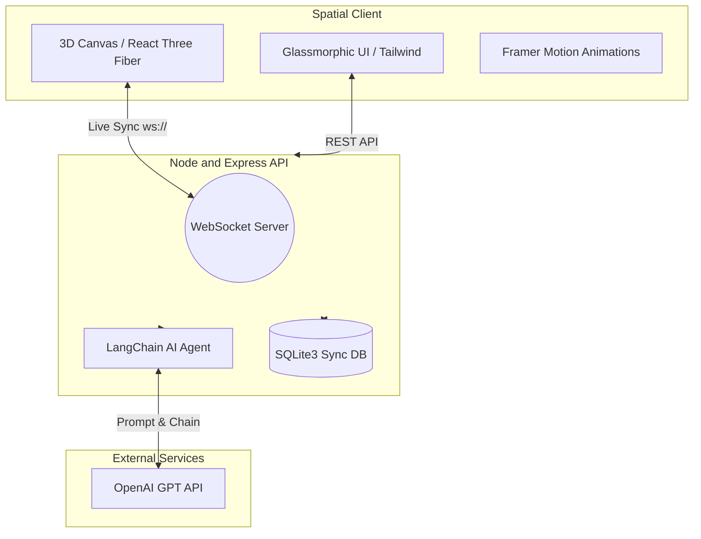

<div align="center">
  
# 🌿 Plantify Pro
**Full-Stack AI Nature Tech for the Modern Botanist**

[](https://react.dev/)
[](https://vitejs.dev/)
[](https://nodejs.org/)
[](https://openai.com/)
[](https://threejs.org/)

<p align="center">
Plantify Pro bridges the gap between biological care and spatial computing. Combining real-time metric syncing, interactive 3D interfaces, and an autonomous AI Diagnostic Agent to ensure your greenhouse thrives.
</p>

</div>

---

## ✨ Premium Features

We've designed Plantify Pro with a glassmorphic aesthetic, micro-interactions, and spatial awareness.

<table>
<tr>
<td width="50%">

### 🧠 "Am I Killing It?" AI Agent
Powered by **OpenAI GPT-4o-mini** and `@langchain/openai`.  
Our autonomous agent analyzes plant symptoms and environmental factors to provide instant, actionable remedies.

</td>
<td width="50%">

### 🪴 3D Greenhouse Dashboard
An interactive, spatial UI built with **React Three Fiber & Drei**.  
Rotate, zoom, and inspect your digital greenhouse twins in real-time right in your browser.

</td>
</tr>

<tr>
<td width="50%">

### ⚡ Real-Time Hardware Sync
Watering from your phone? The desktop 3D greenhouse updates hydration limits instantly using ultra-low latency **Native Node WebSockets**.

</td>
<td width="50%">

### ☁️ Indoor Climate Widget
Contextualize your local weather natively against your greenhouse statistics.  
Featuring glassmorphic sliding drawers powered by **Framer Motion**.

</td>
</tr>
</table>

> 🎧 **Ambient Serenity Engine:** Toggle an immersive, dynamically generated greenhouse audio environment loop directly from the UI for ultimate focus and relaxation.

---

## 🏗 System Architecture

Plantify Pro uses a decoupled, event-driven architecture to ensure the 3D UI never drops frames while processing complex AI diagnostics in the background.



---

## 🛠 Tech Stack Details

### Frontend Canvas

- **Framework:** React.js (TypeScript) + Vite for lightning-fast HMR  
- **Styling:** Tailwind CSS for atomic, responsive layouts  
- **Animation:** Framer Motion for fluid layout transitions and glassmorphic drawer states  
- **Spatial Rendering:** React Three Fiber (R3F) & Drei for high-fidelity 3D plant rendering  

### Backend Engine

- **Server:** Node.js + Express for robust JSON endpoint routing  
- **Real-Time:** `ws` package for native, lightweight WebSocket broadcasting  
- **Database:** SQLite3 for zero-config, fast, file-based synchronous data storage  
- **AI Pipeline:** LangChain.js orchestration communicating with OpenAI APIs  

---

## 🚀 Getting Started

### 0. Prerequisites

- **Node.js:** v20.x or higher recommended  
- **OpenAI API Key:** Required for the Diagnostic Agent  

---

### 1. Environment Setup

Create a `.env` file inside the `backend/` directory:

```env
# OpenAI Key for the LangChain Agent (Required)
OPENAI_API_KEY=sk-your-premium-api-key-here

# Port Configuration (Defaults to 8000)
PORT=8000
```

---

### 2. Booting the Backend

```bash
cd backend

# Install dependencies
npm install

# Start Express and WebSocket server (with hot-reload)
npm run dev
```

---

### 3. Launching the Spatial Frontend

```bash
cd frontend

# Install UI and 3D dependencies
npm install

# Start the Vite development server
npm run dev
```

Visit: **http://localhost:5173**

---

<div align="center">
<sub>Built with 💚 for the Future of Nature Tech.</sub>
</div>